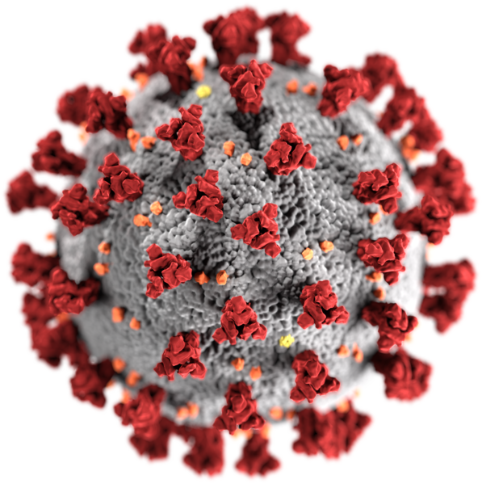

<div align="center">

  
	<h1>Coronavirus API Wrapper</h1>
	<strong> <i>A wrapper to work with the <a href="https://www.covid19api.dev/">Coronavirus API</a></i></strong><br><br>


<br>

[](https://travis-ci.org/phooni/coronavirusapi-wrapper)
<br>


</div>
<br>

## Installation

```sh
$ npm install coronavirusapi-wrapper --save
```

## How To Use

### ES6

```js

import CoronaVirusApiWrapper from 'coronavirusapi-wrapper';

const apiWrapper = new CoronaVirusApiWrapper({
  token: "Your_Token"
});

// Daily Reports for May 2021
apiWrapper.this.getReportsAt(new Date(Date.parse('may-2021'))).then(function (d) {
  console.log("Daily Reports for May 2021");
  console.log({ code: d.Code, message: d.Message, 1: d.Document[0], 2: d.Document[1] });
});

// Daily Reports for May 2021
apiWrapper.getMay2021().then(function (d) {
  console.log("Daily Reports for May 2021");
  console.log({ code: d.Code, message: d.Message, 1: d.Document[0], 2: d.Document[1] });
});

// Get Confirmed Cases TimeSeries in the US
apiWrapper.getTimeSeriesConfirmedUs().then(function (timeseries) {
  console.log("Confirmed Cases Time Series in the US");
  console.log({ code: timeseries.Code, message: timeseries.Message, 1: timeseries.Reports[0].Data });
});

```

### CommonJS

```js
const CoronaVirusApiWrapper = require('coronavirusapi-wrapper').default;

const apiWrapper = new CoronaVirusApiWrapper({
  token: "YOUR_TOKEN_HERE"
});
```

### UMD in Browser

```html
<!-- to import non-minified version -->
<script src="coronavirusapi-wrapper.umd.js"></script>

<!-- to import minified version -->
<script src="coronavirusapi-wrapper.umd.min.js"></script>
```

After that the library will be available to the Global as `CoronaVirusApiWrapper`. Follow an example:

```js

const apiWrapper = new CoronaVirusApiWrapper({
  token: "Your_Token"
});

// Daily reports for May-2021
apiWrapper.getMay2021().then(function (d) {
  console.log("Daily reports for May 2021");
  console.log({ code: d.Code, message: d.Message, 1: d.Document[0], 2: d.Document[1] });
});

```

## Contributing

Please read [CONTRIBUTING.md](https://gist.github.com/PurpleBooth/b24679402957c63ec426) for details on our code of conduct, and the process for submitting pull requests to us.

## Versioning

We use [SemVer](http://semver.org/) for versioning. For the versions available, see the [tags on this repository](https://github.com/Cloudeya/coronavirusapi-wrapper/tags).

## License

This project is licensed under the [WTFPL License](LICENSE) - see the file for details.

## Copyright

(c) 2020 [Phooni Limited](https://phooni.com).

